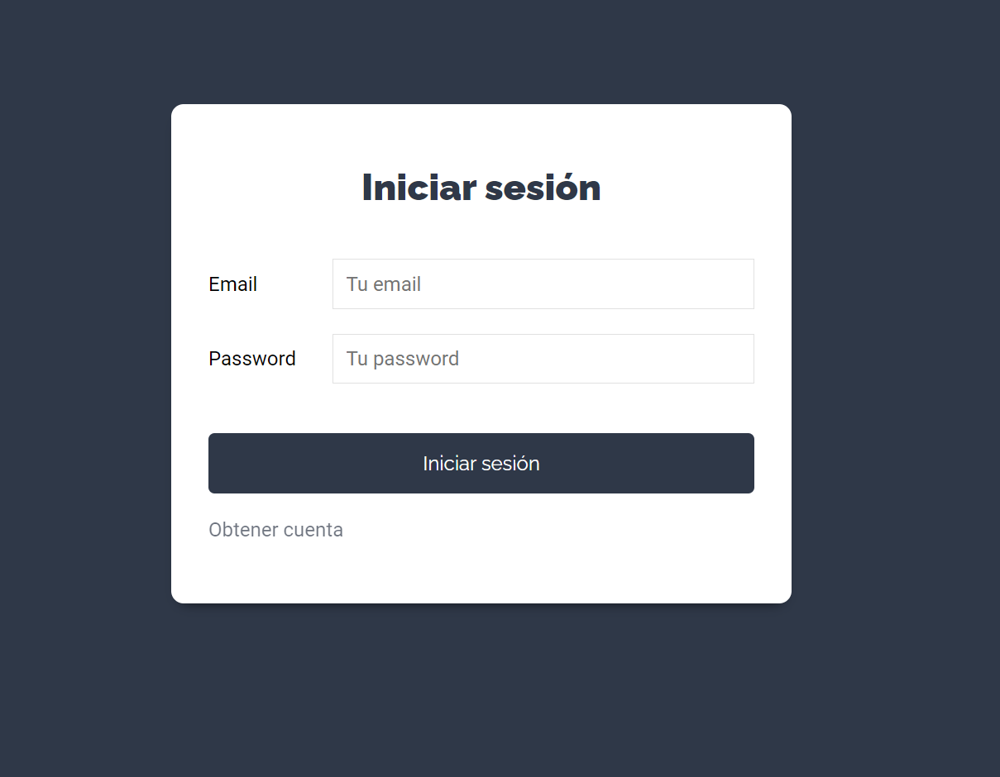
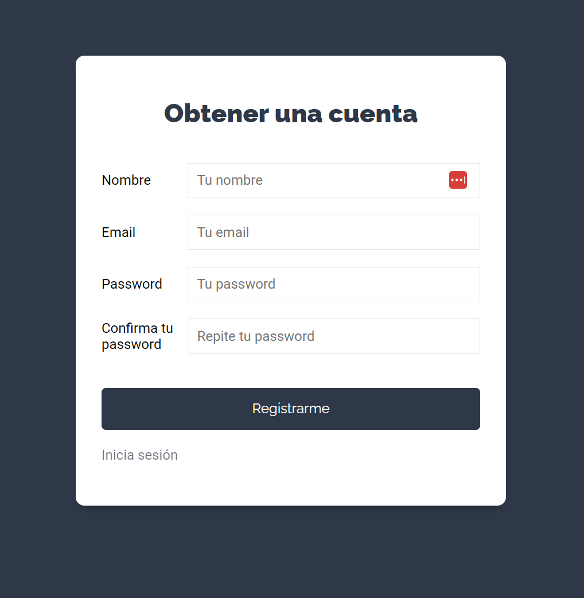
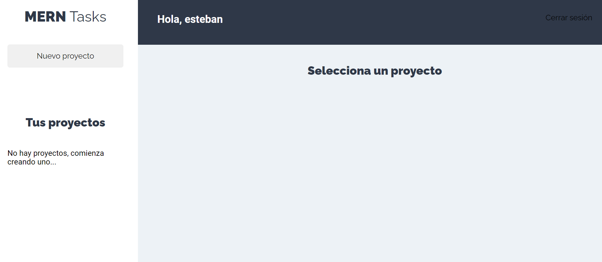
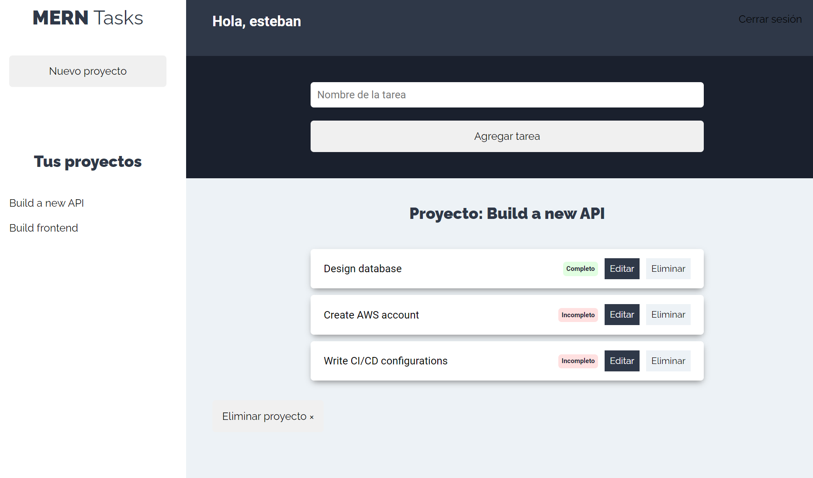

# mern-projects-tasks

This is a web application to manage pending tasks to do. You can add multiple project with their own specific tasks.

MERN stack means Mongo, Express, React, Node technologies

1. Clone this project

    `git clone git@github.com:esmejia277/mern-projects-tasks.git`

2. Provide a mongodb instance
   
    We will provide a docker container as a mondodb instance
    
    a. Install docker [docker documentation](https://docs.docker.com/)

    b. Create a mongodb container based on [the official docker image](https://hub.docker.com/_/mongo)
 
    `docker run --name mongodb -v 
     $HOME/docker_volumes/mongo:/data/db -p 27017:27017 -d mongo`

3. Export environment variables
    
    Be careful with these values, they are considered sensitive data since they contains the database credentials,
    json web token secret.

    Go to the working directory and modify the next files

    `server/vars.env:`
    
       DB_MONGO=mongodb://localhost:27017
       SECRET_JWT=topsecret

    
    `client/.env` files
        
       REACT_APP_BACKEND_URL=http://localhost:4000/

4. Start the `client` and `server`

    `client`
     
       npm run install
       npm run start

    `server`
     
       npm run install
       npm run dev   (for development purposes)
       npm run start (for production purposes)

5. You will see the user interface

    

    

    
    
    